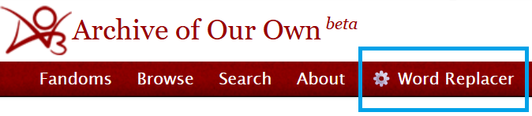
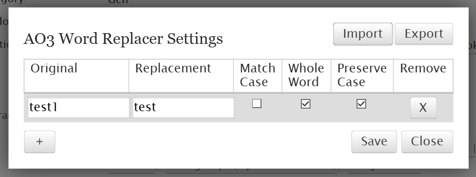

# AO3 Word Replacer

AO3 Word Replacer is a browser extension that lets you create and manage a list of words to automatically replace in AO3 fanfiction text.

**Features:**

- Replace words or phrases with your preferred alternatives.
- Match text case-sensitively or ignore capitalization.
- Replace whole words only, preventing unintended partial replacements.
- Preserve the original capitalization pattern of replaced words.
- Export and import your word list for easy backups or transfers.

## Installation

[TBD]

## Usage

After installation, a new button will appear in your AO3 navigation bar: **⚙️ Word Replacer**.



Clicking this button opens the settings modal, where you can configure your replacement list:



### Settings Overview

| Option        | Meaning                                                                                                                                                    |
| ------------- | ---------------------------------------------------------------------------------------------------------------------------------------------------------- |
| Original      | The word or phrase you want to replace (e.g., `Y/N`).                                                                                                      |
| Replacement   | The word or phrase that will replace the original (e.g., `Geert`).                                                                                         |
| Match Case    | Only replaces text that has the exact same capitalization as the original. Example: `Cat` will **not** match `cat` if enabled.                             |
| Whole Word    | Only replaces entire words that match the original. Prevents partial matches inside longer words. Example: `cat` will not replace `cat` inside `catapult`. |
| Preserve Case | Applies the capitalization pattern of the original text to the replacement. Example: `CAT` -> `DOG`, `Cat` -> `Dog`.                                       |
| Remove        | Deletes the entry from your list.                                                                                                                          |

> **Tip**: Always click Save before closing the modal, or your changes will be lost.

### Notes

- All data is stored locally in your browser. Switching browsers or devices starts with an empty list.
- To transfer your list, use the Export and Import buttons in the modal.

## Building from Source

If you want to build the extension yourself, follow these steps:

**Prerequisites:**

- Install [Node.js](https://nodejs.org/en)
- [Clone](https://docs.github.com/en/repositories/creating-and-managing-repositories/cloning-a-repository) or download this repository

**Steps:**

1. **Install dependencies**

   ```bash
   npm install
   ```

2. **Build the extension**

   To run the default build command, use:

   ```bash
   npm run build
   ```

   This automatically builds extensions for Chrome and Firefox that use local (extension) storage.

   Alternatively, you can manually run `build.js` with custom options:

   ```bash
   node build.js --browser=<chrome|firefox|all> --storage=<local|sync|localStorage>
   ```

3. **Load it into your browser:**

   **Chrome/Edge**:

   1. Go to `chrome://extensions/`
   2. Enable **Developer Mode**
   3. Click **Load Unpacked**
   4. Select the relevant output folder within `dist`

   **Firefox**:

   1. Go to `about:debugging#/runtime/this-firefox`
   2. Click **Load Temporary Add-on**
   3. Select the `manifest.json` in the relevant output folder within `dist`
